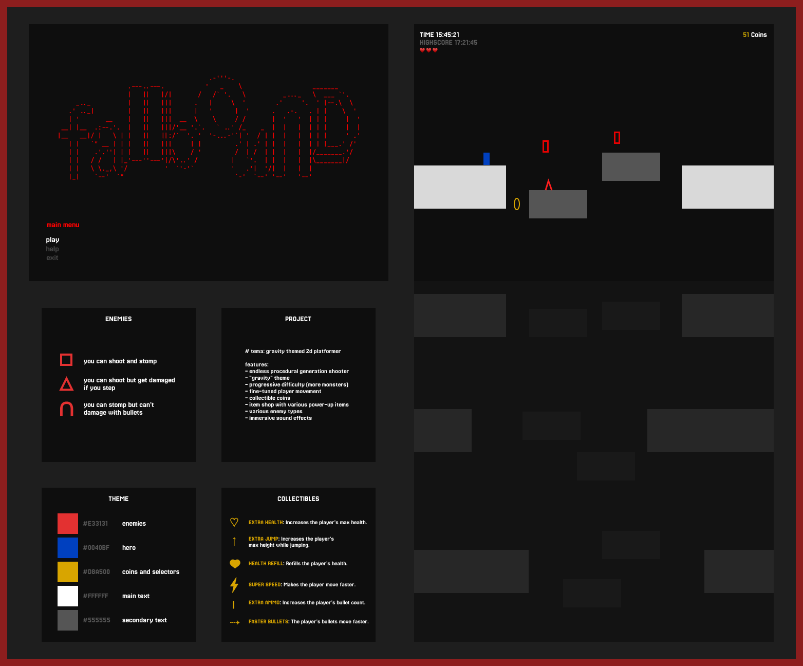

# LDTS t06g03 - Fallbound

> **Fallbound** is a 2D platformer game where the player must fall down a series of platforms and gain power while defeating enemies. How far can you fall?

## THE IDEA

We wanted a game that was simple and fun to play. We decided to create a 2D platformer game where the player falls through a series of platforms while shooting down enemies. For this, the player movement must be refined to feel smooth and responsive. Your objective is to survive as long as possible. 

## CONTROLS

### GAMEPLAY
- `Left Arrow` or `A` - move left.
- `Right Arrow` or `D` - move right.
- `Space` - jump and shoot.
- `Escape` - open pause menu.

### MENUS
- `Up Arrow` - select previous option.
- `Down Arrow` - select next option.
- `Enter` - confirm selection.

## IMPLEMENTED FEATURES

- **Player Movement** - the player can move left, right, and jump. Movement was very carefully designed to feel smooth and responsive.
- **Procedural World Generation** - the game has a procedural platform generation system that allows the player to play infinitely.
- **Bullets** - the player has bullets that can be used to shoot monsters and traverse the world with its recoil. Bullets can only be shot when the player is in the air and are recharged when the player touches the ground.
- **Breakable Walls** - the player can break some walls by shooting them.
- **Player Health** - the player has a life counting system. When the player runs out of lives the game ends.
- **Enemies** - the player will have to defeat several types of enemies, each with their own unique ways to be defeated.
- **Difficulty Progression** - the game will get harder as time passes. Enemies will spawn more frequently and new enemy types will appear.
- **Coins** - the player can collect coins to purchase items at the shop.
- **Shop and Power-Ups** - the player can buy different items at the shop, like the Power-Ups that permanently increase the player's abilities or extra lives.
- **Menus** - the game has a main menu, a pause menu and a game over menu.
- **Sound** - the game has sound effects and music.
- **Timer** - the game has a timer that counts the time the player has been playing. This is the main score of the game.
- **Highscore Functionality** - the game will keep a local track of the player's highest score.

## MOCKUPS AND SCREENSHOTS

### Game Mockups

### Game Screenshots

### Gameplay

