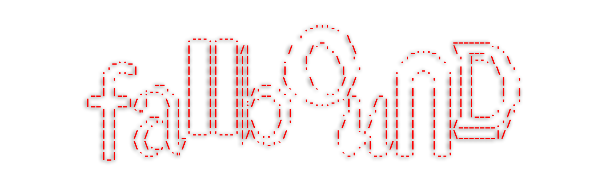

# LDTS t06g03 - Fallbound

**Fallbound** is a 2D platformer game where the player must fall down a series of platforms and gain power while defeating 
enemies. How far can you fall?

## THE IDEA

We wanted a game that was simple and fun to play. We decided to create a 2D platformer game where the player falls through a series of platforms while shooting down enemies. For this, the player movement must be refined to feel smooth and responsive. In our game, the main score would be the time, and the objective would be to survive as long as possible. 

## CONTROLS

### GAMEPLAY
- `Left Arrow` - move left.
- `Right Arrow` - move right.
- `Space` - jump.
- `Escape` - open pause menu.

### MENUS
- `Up Arrow` - select previous option.
- `Down Arrow` - select next option.
- `Enter` - confirm selection.

## IMPLEMENTED FEATURES

- **Player Movement** - the player can move left, right, and jump.
- **Wall Collision** - the player collides with the walls. 
- **Timer** - the game has a timer that counts the time the player has been playing. this will be the main score of the game.
- **Coins** - the player can collect coins to increase his power.
- **Menus** - the game has a main menu and a pause menu. there is also a death menu that currently is only accessible by pressing the "q" key.

## FUTURE FEATURES

- **Enemies** - the player will have to defeat enemies to progress in the game. there will be different types of enemies that require different strategies to defeat.
- **Power-ups** - the player will be able to purchase power-ups that will give him special abilities.
- **Procedural World Generation** - the game will have a procedural platform generation system that allows the player to play infinitely. 
- **Difficulty progression** - the game will get harder as time passes. enemies will be faster and stronger.
- **Sound** - the game will have sound effects and background music.
- **Challenge Mode** - the game will have a challenge mode where the player must achieve a maximum score in a limited time.

## MOCKUPS AND SCREENSHOTS

<h4 align="center">
  Figma Mockup
 
    
</h4>
<h4 align="center">
  Main Menu
 
  
</h4>
<h4 align="center">
  Current Game Scene
 
    
</h4>
<h4 align="center">
  Current Gameplay
 
    
</h4>

