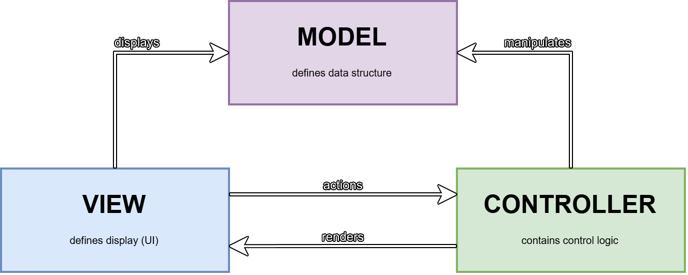

# LDTS_t06g03 - Fallbound 

### the project was developed by:
- **Simão Barbosa** (up202306609)
- **Pedro Araújo** (up202306606)
- **Martim Cadilhe** (up202307833)

**Fallbound** is a 2D platformer game where the player must fall down a series of platforms and gain power while defeating enemies. How far can you fall?

## CONTROLS

### GAMEPLAY
- `Left Arrow` - move left.
- `Right Arrow` - move right.
- `Space` - jump.
- `Escape` - open pause menu.

### MENUS
- `Up Arrow` - select previous option.
- `Down Arrow` - select next option.
- `Enter` - confirm selection.

## IMPLEMENTED AND PLANNED FEATURES

### IMPLEMENTED FEATURES

- **Player Movement** - the player can move left, right, and jump.
- **Wall Collision** - the player collides with the walls.
- **Timer** - the game has a timer that counts the time the player has been playing. This will be the main score of the game.
- **Coins** - the player can collect coins to increase their power.
- **Menus** - the game has a main menu and a pause menu. There is also a game over menu that currently is only accessible by pressing the "q" key.

### FUTURE FEATURES

- **Continue Option** - allow player to unpause game.
- **Enemies** - the player will have to defeat enemies to progress in the game. There will be different types of enemies that require different strategies to defeat.
- **Power-ups** - the player will be able to purchase power-ups that will give him special abilities.
- **Procedural World Generation** - the game will have a procedural platform generation system that allows the player to play infinitely.
- **Difficulty progression** - the game will get harder as time passes. Enemies will be faster and stronger.
- **Sound** - the game will have sound effects and background music.
- **Challenge Mode** - the game will have a challenge mode where the player must achieve a maximum score in a limited time.

## GENERAL STRUCTURE

## CODE DESIGN

Design patterns are standardized solutions that developers can apply to address recurring challenges in application or system design. For a project of this nature, it's important to have a good code design to make the project more maintainable and scalable. 

### STRUCTURE

When developing software with a user interface, it's crucial to implement a proper structural pattern. The code must be organized and modular to uphold the Single Responsibility Principle. For this project, we decided to use the Model-View-Controller (MVC) pattern. This pattern organizes the application into three connected components, isolating the internal data representations from how the information is displayed and interacted with by the user:
 - Model - represents the data and game logic;
 - View - displays the model and sends actions to the controller;
 - Controller - provides a model to view and interprets user actions.
 

#### Consequences of using MVC:
- Keeps our code organized by separating tasks.
- Makes it easier to add new features and test parts individually.
- Improves our code's readability and maintainability.

### STATES

When developing a game, it's important to have a clear way to manage different states, such as the main menu, pause menu or the gameplay. Without proper organization, transitions between these states can become complicated and error-prone. To address this, we decided to use the State Pattern. This pattern simplifies state management by organizing behaviors into distinct classes, ensuring cleaner and more modular code.

#### Consequences of using States:
- If not carefully implemented, state transitions might lead to tightly coupled state objects, making changes harder in the long run.

### SINGLETON

In our game, we used the Singleton pattern to ensure that a class, in this case, the State class, has only one instance and can be accessed from all parts of the project.

#### Consequences of using Singleton:

- The use of Singleton can make testing more difficult, as the global instance may maintain state between tests.
- Although convenient, global access can lead to hidden dependencies in the code.

### GAME LOOP

To ensure that the game is responsive and updates occur at a constant rate, we need to apply the Game Loop. This was applied to the Game class and describes the continuous cycle of updating and rendering required to run a game efficiently and smoothly, consisting of three main stages that repeat throughout the game's execution:

- Input - represents the key presses;
- Update - involves calculating the new game state, player movement, collisions, etc.;
- Render - the loop calls the methods to draw or render the current game state on the screen.

#### Consequences of using Game Loop:

- If not carefully optimized the game loop can consume a lot of processing power, leading to performance issues or excessive battery consumption.
