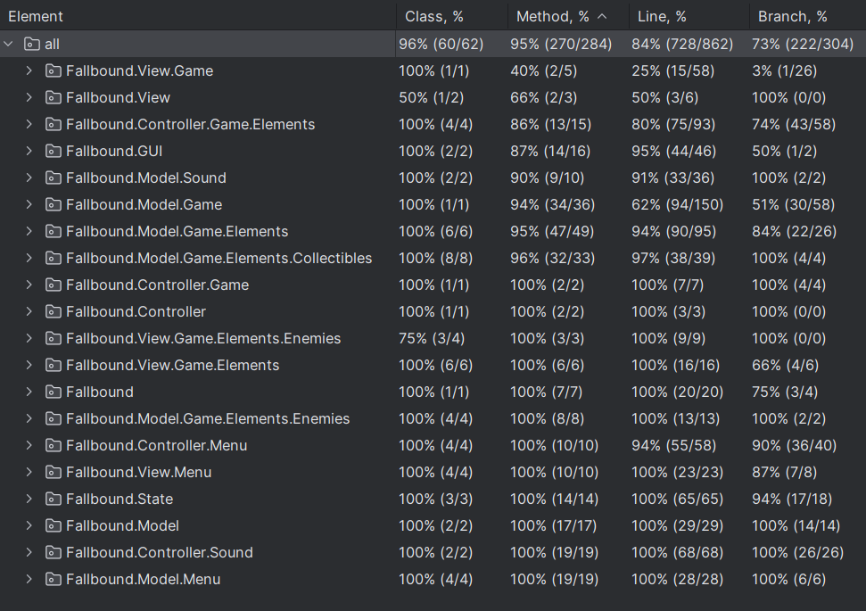

# LDTS_t06g03 - Fallbound 

> **Fallbound** is a 2D platformer game where the player must fall down a series of platforms and gain power while defeating enemies. How far can you fall?

### this project was developed by:
- **Simão Barbosa** (up202306609)
- **Pedro Araújo** (up202306606)
- **Martim Cadilhe** (up202307833)

## CONTROLS

### GAMEPLAY
- `Left Arrow` or `A` - move left.
- `Right Arrow` or `D` - move right.
- `Space` - jump.
- `Escape` - open pause menu.

### MENUS
- `Up Arrow` - select previous option.
- `Down Arrow` - select next option.
- `Enter` - confirm selection.

## IMPLEMENTED FEATURES

- **Player Movement** - the player can move left, right, and jump. Movement was very carefully designed to feel smooth and responsive.
- **Procedural World Generation** - the game has a procedural platform generation system that allows the player to play infinitely.
- **Bullets** - the player has bullets that can be used to shoot monsters and traverse the world with its recoil. Bullets are recharged when the player touches the ground.
- **Breakable Walls** - the player can break some walls by shooting them.
- **Player Health** - the player has a life counting system. When the player runs out of lives the game ends.
- **Enemies** - the player will have to defeat several types of enemies, each with their own unique ways to be defeated.
- **Difficulty Progression** - the game will get harder as time passes. Enemies will spawn more frequently and new enemy types will appear.
- **Coins** - the player can collect coins to purchase items at the shop.
- **Shop and Power-Ups** - the player can buy different items at the shop, like the Power-Ups that permanently increase the player's abilities or extra lives.
- **Menus** - the game has a main menu, a pause menu, and a game over menu.
- **Sound** - the game has sound effects and music.
- **Timer** - the game has a timer that counts the time the player has been playing. This is the main score of the game.
- **Highscore Functionality** - the game will keep a local track of the player's highest score.

### ENEMIES
- █ - [**Normal Enemies**](../src/main/java/Fallbound/Model/Game/Elements/Enemies/NormalEnemy.java): This enemy can fly. Can be defeated by bullets or a player's stomp.
- Δ - [**Spike Enemy**](../src/main/java/Fallbound/Model/Game/Elements/Enemies/SpikeEnemy.java) : This enemy can fly and is slower than the others. Can only be defeated by bullets.
- ∩ - [**Shell Enemy**](../src/main/java/Fallbound/Model/Game/Elements/Enemies/ShellEnemy.java) : This enemy is bound to the platforms. Can only be defeated by stomping.

### COLLECTABLES
- ♡ - [**Extra Health**](../src/main/java/Fallbound/Model/Game/Elements/Collectibles/MaxHealthCollectible.java): Increases the player’s max health.
- ↑ - [**Jump Height**](../src/main/java/Fallbound/Model/Game/Elements/Collectibles/JumpCollectible.java): Increases the player’s max height while jumping.
- ♥ - [**Health Refill**](../src/main/java/Fallbound/Model/Game/Elements/Collectibles/HealthCollectible.java): Refills the player’s health.
- 🗲 - [**Speed Boost**](../src/main/java/Fallbound/Model/Game/Elements/Collectibles/SpeedCollectible.java): Makes the player move faster.
- | - [**Extra Bullets**](../src/main/java/Fallbound/Model/Game/Elements/Collectibles/BulletCountCollectible.java): Increases the player’s bullet count.
- ⇢ - [**Faster Bullets**](../src/main/java/Fallbound/Model/Game/Elements/Collectibles/BulletSpeedCollectible.java): The player’s bullets move faster.

## GENERAL STRUCTURE

## CODE DESIGN

### STRUCTURE

#### Problem in context
Design patterns are standardized solutions that developers can apply to address recurring challenges in application or system design. For a project of this nature, it's important to have a good code design to make the project more maintainable and scalable.  
When developing software with a user interface, it's crucial to implement a proper structural pattern. The code must be organized and modular to uphold the Single Responsibility Principle.

#### The Pattern
For this project, we decided to use the Model-View-Controller (MVC) pattern.

This pattern organizes the application into three connected components, isolating the internal data representations from how the information is displayed and interacted with by the user:
 - Model - represents the data and game logic;
 - View - displays the model and sends actions to the controller;
 - Controller - provides a model to view and interprets user actions.

 

#### Implementation
Here is how we implemented the MVC pattern:

- [Model](../src/main/java/Fallbound/Model)

- [View](../src/main/java/Fallbound/View)

- [Controller](../src/main/java/Fallbound/Controller)

#### Consequences of using MVC:
- Clear separation of concerns aligns with SOLID principles, making the code easier to extend, test, and debug.
- Adding features requires minimal changes to existing components.
- Independent layers ensure efficient unit testing and adherence to SRP.
- Organized structure improves collaboration and reduces complexity.

### GAME LOOP

#### Problem in Context
An important characteristic to every application's design is the need to constantly update every entity while said application is running.
Having a way to control how fast the game runs is extremely important and must be considered during its design.

#### Game Loop Pattern
To ensure that the game is responsive and updates occur at a constant rate, we need to apply the Game Loop. This was applied to the Game class and describes the continuous cycle of updating and rendering required to run a game efficiently and smoothly, consisting of three main stages that repeat throughout the game's execution:

- Input - represents the key presses;
- Update - involves calculating the new game state, player movement, collisions, etc.
- Render - the loop calls the methods to draw or render the current game state on the screen.

#### Implementation
Here are some examples of the Game Loop pattern at work:

- [Game](../src/main/java/Fallbound/Game.java)

#### Consequences of using Game Loop:

- If not carefully optimized the game loop can consume a lot of processing power, leading to performance issues or excessive battery consumption.
- As the game grows in complexity the game loop may need to accommodate additional processing. Without scalable design, the loop could become overloaded and rigid, leading to degraded performance or the need for a major refactor.

### HANDLING GAME STATES

#### Problem in Context
When developing a game, it's important to have a clear way to manage different states, such as the main menu, pause menu or the gameplay. Without proper organization, transitions between these states can become complicated and error-prone.  
There are multiple ways to obtain this, such as creating classes that use several boolean statements to check which state the game is currently on.
For example, a menu class that changes its behavior according to the state of the application (i.e. pause, game over or start).   
However, this solution violates two of the principles of Object-Oriented design, the Single Responsibility Principle and the Open-Closed Principle, as having all possible types of menus within the same class, forces them to be dependent on each other. Also, if there is ever need to add another state to the application, it would force the modification of the entire class.

#### State Pattern
To address this, we decided to use the State Pattern. This pattern simplifies state management by organizing behaviors into several distinct classes that extend an abstract class, in accordance with the Open-Closed Principle and the Single Responsibility Principle, ensuring cleaner, less rigid and more modular code.
The state class is merely responsible for handling transitions between states not the behavior of the states themselves.

#### Implementation
Here is an example of the State Pattern at work:

- [State](../src/main/java/Fallbound/State)

#### Consequences of using States:
- If not carefully implemented, state transitions might lead to tightly coupled state objects, making changes harder in the long run.
- Frequent state changes or complex state transitions might introduce performance overhead or make debugging more challenging.
- Each state class has a single responsibility, encapsulating specific behavior, making the code easier to understand and maintain.
- Adding new states or modifying behaviors doesn’t require changes to existing state classes, supporting scalability and promoting the Open-Closed principle.

### SINGLE STATE INSTANCE

#### Problem in context
This game follows the MVC design structure, hereby taking into account multiple components at the same time that interact with each other, such as the UI, the controller and the models.  
With these components, the need to control the game's state consistently across the different components rise.

#### Singleton Pattern
A solution to this is the use of the Singleton pattern to ensure that a class, in this case, the State class, has only one instance and can be accessed from all parts of the project. 

#### Implementation
Here is the Singleton pattern at work:

- [State](../src/main/java/Fallbound/State) 
- [Sound Controller](../src/main/java/Fallbound/Controller/Sound/SoundController.java)

#### Consequences of using Singleton:

- The use of Singleton can make testing more difficult, as the global instance may maintain state between tests.
- Although convenient, global access can lead to hidden dependencies in the code.
- Since the Singleton instance is globally accessible, modifying the State class could impact multiple classes, making the design harder to extend without changing existing code, contradicting the Open/Closed Principle.
- This design reduces the need for synchronization.
- Simplifies code maintenance by adhering to the Single Responsibility Principle, as only the State class is responsible for game state management.

### Collectables

#### Problem in context
For our game, we envisioned several collectable items that can be obtained throughout the game, that give the player a certain advantage.
These collectables, despite giving different advantages, have to behave in a cohesive and organized manner.   
A way to obtain this would be to let the scene handle the creation of the collectables, via a method similar to the one used for platform generation.  
However, this would violate the Open/Closed principle, as if we ever wanted to add another type of collectable, it would require modification to the entire scene class, which is just unnecessary.

#### Factory Pattern
The way we chose to deal with this issue is by using the Factory pattern.
A "factory" class was created to specifically handle the creation of said collectables according to their type and with no need to specify which class the object belongs to.  
This way, we abide by the Single Responsibility Principle and the Open/Closed Principle, making our code less susceptible to code decay.

#### Implementation
Here is where we implemented the Factory method:

- [Collectable](../src/main/java/Fallbound/Model/Game/Elements/Collectibles/CollectibleFactory.java)

#### Consequences of using Collectables
- Introducing a Factory class adds a layer of abstraction. While this can simplify object creation for the scene class, it also makes the codebase more complex overall.
- If collectables were to ever require dynamic parameters or context-specific initialization, the factory pattern can become rigid or cumbersome.
- While the Factory pattern helps the scene class adhere to OCP, the factory itself might still need modifications when new collectable types are introduced.

### KNOWN CODE SMELLS
Throughout the development process and after a re-analysis of our code, we identified some code smells that could be improved:

- **God Class**: The [Scene](../src/main/java/Fallbound/Model/Game/Scene.java) class handles numerous responsibilities, including player management, bullet movement, collision detection, enemy spawning, and platform generation. In hindsight, this centralization of logic makes the class overly complex and harder to maintain, and could probably be fixed with some more time by breaking it down into smaller classes.
- **Duplicate Code**: There is some duplicated logic, such as the handling of key events in [PlayerController](../src/main/java/Fallbound/Controller/Game/Elements/PlayerController.java) and [SceneController](../src/main/java/Fallbound/Controller/Game/SceneController.java). In retrospective, this could be refactored into a common utility or base class.
- **Lengthy switch statements**: Big switch statements in the [State](../src/main/java/Fallbound/State/State.java) and [SoundController](../src/main/java/Fallbound/Controller/Sound/SoundController.java) classes manage application states and sound behaviors, respectively. While justified by their responsibilities, this could be improved by using polymorphism to delegate behavior to specialized classes.

### TESTING

#### Test Coverage

#### Pitest Mutation Testing

- To ensure effective mutation testing, we excluded the [LanternaGUI](../src/main/java/Fallbound/GUI/LanternaGUI.java) and [Game](../src/main/java/Fallbound/Game.java) classes. LanternaGUI could conflict with Pitest due to its use of Lanterna, while testing the Game class, which runs the main function and game loop, would be unnecessary and problematic.

### SELF-EVALUATION todo
- **Simão Barbosa**:
- **Pedro Araújo**:
- **Martim Cadilhe**:
